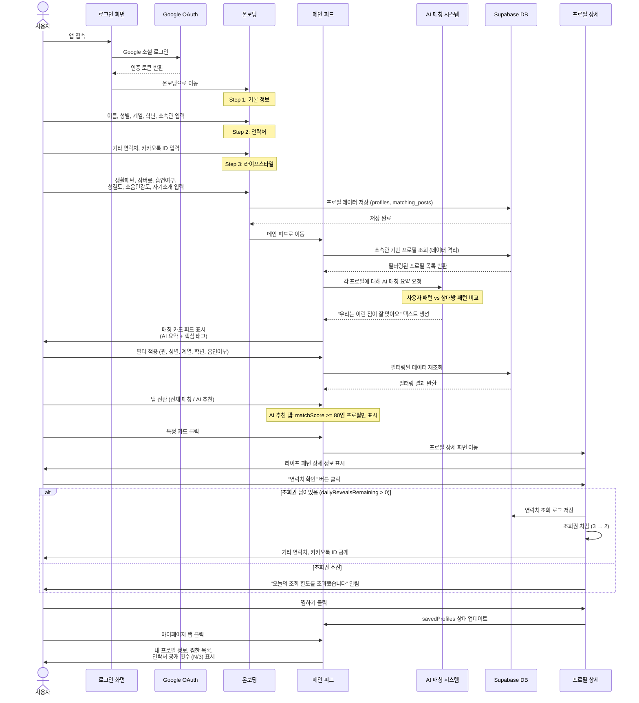
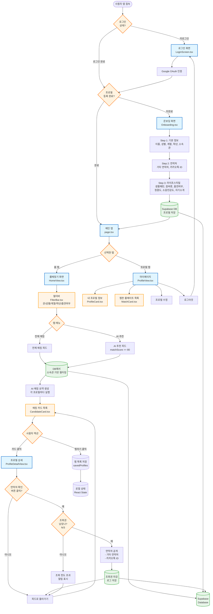
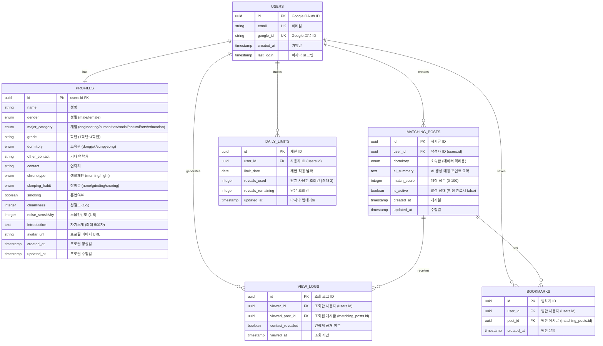

# 매칭미? (Matching Me?) - Mermaid Diagrams

## 1. 사용자 여정 및 로직 흐름 (Sequence Diagram)

---

## 2. 서비스 아키텍처 및 페이지 구조 (Flowchart)

---

## 3. 데이터 관계도 (ERD - Entity Relationship Diagram)

---

## 데이터 모델 설명

### 핵심 데이터 흐름

1. **사용자 등록 및 프로필 생성**
   - `USERS` 테이블: Google OAuth를 통한 인증 정보 저장
   - `PROFILES` 테이블: 온보딩 3단계에서 수집한 모든 개인정보 저장
   - `MATCHING_POSTS` 테이블: AI 요약과 함께 매칭용 게시글 생성

2. **데이터 격리 (Dormitory-based Filtering)**
   - `MATCHING_POSTS.dormitory` 필드로 동작관/은평관 분리
   - 사용자는 자신의 소속관 데이터만 조회 가능

3. **조회권 시스템 (Phase 2)**
   - `DAILY_LIMITS` 테이블: 일일 연락처 조회 횟수 추적 (최대 3회)
   - `VIEW_LOGS` 테이블: 모든 조회 기록 저장 (감사 로그)

4. **찜하기 기능**
   - `BOOKMARKS` 테이블: 나중에 연락하고 싶은 프로필 저장
   - 마이페이지에서 찜한 목록 확인 가능

---

## Phase 1 (MVP) vs Phase 2 (고도화) 차이점

### Phase 1 구현 범위

- ✅ Google 소셜 로그인
- ✅ 3단계 온보딩
- ✅ 소속관 기반 데이터 격리
- ✅ AI 매칭 요약 카드 피드
- ✅ 프로필 상세 조회
- ✅ 연락처 즉시 공개

### Phase 2 추가 기능

- 🔲 조회권 시스템 (`DAILY_LIMITS`, `VIEW_LOGS`)
- 🔲 매칭 완료 상태 관리 (`is_active` 플래그)
- 🔲 상세 필터링 (잠버릇, 청결도 등 복합 조건)
- 🔲 찜하기 (`BOOKMARKS`)
- 🔲 이미지 업로드 (Supabase Storage)
- 🔲 스켈레톤 UI 로딩
- 🔲 개인정보 마스킹 (조회권 사용 전)

---

## 기술 스택 매핑

| Layer          | Technology                                                 |
| -------------- | ---------------------------------------------------------- |
| Frontend       | Next.js 14, React, TypeScript, Tailwind CSS, Framer Motion |
| UI Components  | shadcn/ui, Lucide Icons                                    |
| Backend        | Supabase (PostgreSQL)                                      |
| Authentication | Google OAuth 2.0                                           |
| AI             | OpenAI API (매칭 요약 생성)                                |
| Hosting        | Vercel                                                     |
